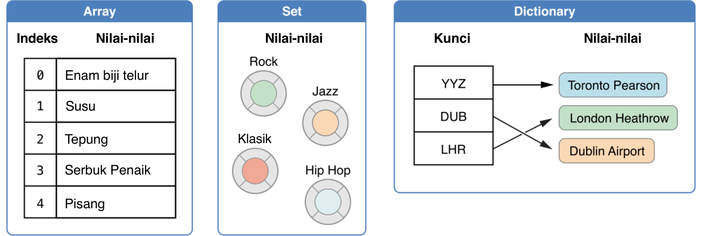

### Jenis-Jenis Koleksi

Swift menyediakan tiga jenis *jenis-jenis koleksi* utama yang dikenal sebagai *arrays*, set dan *dictionaries*, untuk menyimpan koleksi-koleksi nilai-nilai. *Arrays* merupakan koleksi nilai-nilai tertib. Set merupakan koleksi nilai-nilai unik yang tidak tertib. *Dictionaries* merupakan koleksi persatuan *key-value*(kunci bersama nilai) yang tidak tertib.

  

*Arrays*, set dan *dictionaries* dalam Swift adalah sentiasa jelas terhadap jenis-jenis nilai-nilai dan *keys*(kunci) yang boleh disimpan. Ini bermakna anda tidak boleh bersilap apabila memasukkan nilai yang jenisnya berbeza. Ia juga bermakna anda boleh memiliki keyakinan terhadap jenis nilai-nilai yang anda akan menerima dari sesuatu koleksi.

> Nota: *Arrays*, set dan *dictionaries* dalam Swift dipasangkan melalui *koleksi generik*. Untuk lebih maklumat tentang hubungan jenis generik dengan koleksi, lihatlah bab Generik.
