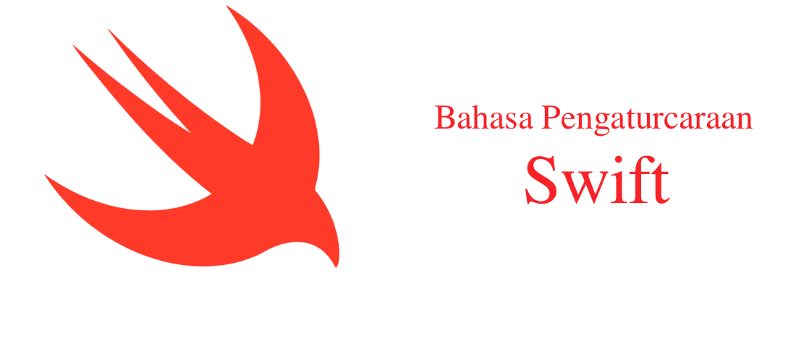

    

Kandungan kerja penterjemahan ini berdasarkan ["The Swift Programming Language (Swift 2.2)"](https://swift.org/documentation/TheSwiftProgrammingLanguage(Swift2.2).epub) yang disediakan di bawah lesen [Creative Commons Attribution 4.0 International (CC BY 4.0) License](https://creativecommons.org/licenses/by/4.0/).

Dapatkan Swift dari <https://swift.org/download/>.

Para penyumbang, sila melawati cawangan(*branch*) ["BelumSelesai"](https://github.com/contraultra/The-Swift-Programming-Language-in-Malay/tree/BelumSelesai) dan merujuk kepada rencana [Bahasa Pengaturcaraan - Wikipedia Bahasa Melayu, ensiklopedia bebas](https://ms.wikipedia.org/wiki/Bahasa_pengaturcaraan) untuk kerja penterjemahan.

